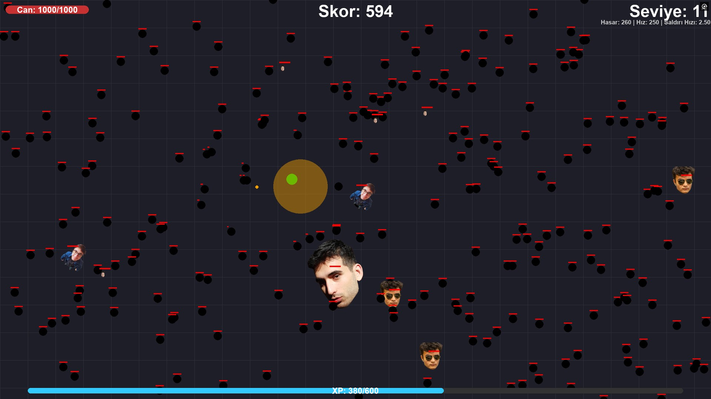
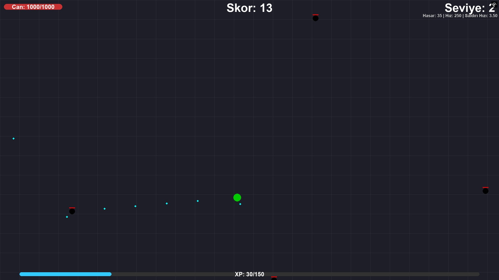

<div align="center">
  <h1>🚀 Escape from friends</h1>
  <p>Vampire Survivors tarzında, arkadaşlarınızdan kaçmaya ve hayatta kalmaya çalıştığınız, aksiyon dolu 2D arena nişancı oyunu!</p>
</div>

<br>

> [!NOTE]
> Bu oyun tamamen Python ve Pygame kullanılarak geliştirilmiştir.

## 📸 Ekran Görüntüleri

*(Lütfen oyundayken ekran görüntüleri (SS) alıp `assets/images/` klasörünün içine kaydedin. İlk fotoğrafın adını `screenshot1.png`, ikinci (menü vb.) fotoğrafın adını `screenshot2.png` yaparsanız burada otomatik olarak harika gözükecektir!)*






## 🎮 Özellikler

- **Gelişmiş Seviye Sistemi:** Düşmanları yenerek XP toplayın ve seviye atlayın!
- **Silah Seçimi:** Oyuna başlarken kendi oyun tarzınıza uygun silahı (**Sektirgeç** veya **Patlangaç**) seçin.
- **Karakter Gelişimi:** Seviye atladıkça saldırı hızı, hareket hızı, hasar ve can gibi özelliklerinizi manuel olarak yükseltin. Aynı zamanda silahınızın özellikleri (çap, sekme sayısı) de oyun ilerledikçe otomatik gelişsin!
- **Epik Boss Savaşları:** Belirli skorlara ulaştığınızda arkadaşlarınız (Onur, Umut, Mami, Kaan, Eren) size farklı mekaniklere sahip devasa Boss'lar olarak saldırır.
- **Dinamik Zorluk:** Siz hayatta kaldıkça düşmanların sayısı, canı ve hareket hızları acımasızca artar.

## 🛠️ Kurulum & Çalıştırma

Oyunu kendi bilgisayarınızda çalıştırmak için aşağıdaki adımları izleyebilirsiniz.

1. **Python ve Pygame Kurulumu:** Sisteminizde Python yüklü olduğundan emin olun, ardından terminal üzerinden Pygame kütüphanesini yükleyin:
   ```bash
   pip install pygame
   ```

2. **Oyunu Başlatın:** Proje dizininde (klasöründe) şu komutu çalıştırarak oynamaya başlayabilirsiniz:
   ```bash
   python escape.py
   ```

## ⌨️ Kontroller

| Tuş | İşlev |
|:---:|:---|
| **W, A, S, D** | Karakteri hareket ettirir. |
| **ESC** | Oyunu duraklatır ve Ayarlar menüsünü açar (Ses / Yeniden Başlatma). |
| **Boşluk (SPACE)** | Oyun bittiğinde yeniden başlatır. |
| **Fare (Sol Tık)** | Menülerde yetenek seçimi yapmak ve ses ayarlarını değiştirmek için kullanılır. |

> [!TIP]
> **Not:** Atış yapmak tamamen otomatiktir! Silahınız her zaman menzilinizdeki veya size en yakındaki düşmana kendiliğinden ateş eder. Tek yapmanız gereken hayatta kalmak!

## 📂 Dosya Yapısı
- `escape.py` - Ana oyun döngüsü, oyun mantığı ve Arayüz (UI) sınıflarının bulunduğu ana kod dosyası.
- `assets/images/` - Düşman görselleri, boss çizimleri ve menü ikonları.
- `assets/audio/` - Oyun içi arka plan müziği ve ses efektleri (Patlama, mermi vb.).
- `HighScore.txt` - En yüksek skorunuzun otomatik olarak kaydedildiği dosya.

---
<div align="center">
<i>Created by alpakay</i>
</div>
